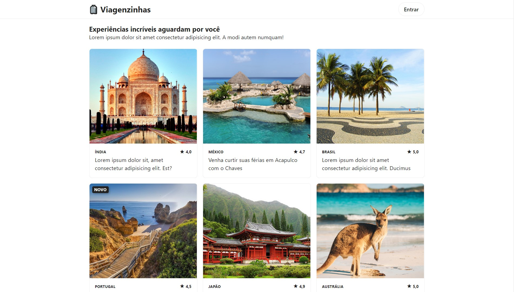
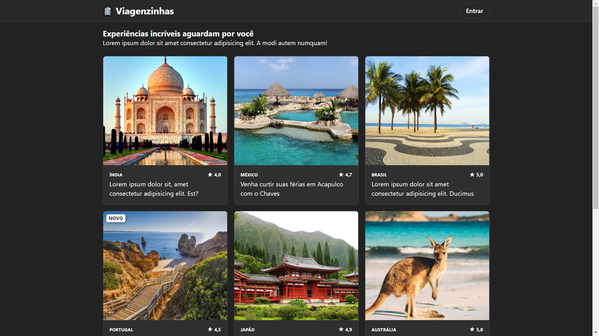

<p align="center">
  
</p>

> Projeto construído como exemplo para a palestra do projeto integrador do curso de Análise e Desenvolvimento de Sistemas, da [UniGuairaca](https://www.guairaca.com.br), no dia 02 de julho de 2020.


### 📝 Como usar?

```bash
# Clone o repositório
$ git clone https://github.com/MattZ6/palestra-projeto-integrador-tads-2020.git viagenzinhas

# Adentre a pasta do projeto
$ cd viagenzinhas

# Abra o arquivo index.html no seu navegador
$ x-www-browser index.html
```

### 🎨 Exemplos






<p align="center">Cheers 🍻</p>
